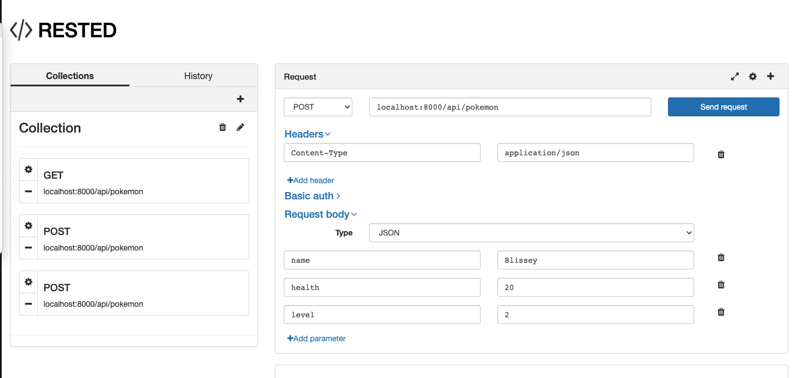

# ma7-pokemon
An API app for Pokemons with create and edit and delete functionality.

## Table of contents
* [General info](#general-info)
* [Play Live](#play-live)
* [Screenshots](#screenshots)
* [Technologies](#technologies)
* [Setup](#setup)
* [Features](#features)
* [Status](#status)
* [Inspiration](#inspiration)
* [Contact](#contact)

## General info
This is an API app with GET, POST, PUT and DELETE requests.

## Screenshots
Here, you see an example of the GET request. 
  
Here, you see an example of the POST request. (for creating pokemon) 
  
Here, you see an example of the PUT request. (for updating pokemon) 
  
  
Here, you see an example of the DELETE request. (for deleting pokemon) 
  
  
 
## Technologies
* JavaScript
* Bootstrap
* Local Storage

## Setup
If you dont have an IDE on your computer, you can install [Visual Code IDE](https://code.visualstudio.com/download). Then you will download the code or clone the repository.
Then you open terminal in that folder and type the command `npm install` , this will install all the dependencies in the package.json file, such as uuid. You can also install nodemon by typing `npm i nodemon` in the terminal. You also need either [Postman](https://www.postman.com/downloads/) or [Rested](https://chrome.google.com/webstore/detail/rested/eelcnbccaccipfolokglfhhmapdchbfg?hl=en-US) google chrome extension to see the results and make requests to the app.  
Once all of the installation is done have the server running by running `nodemon` in terminal in the project folder. Alternatively `node server.js` command will work however you would need to restart the server after each change. Also have the Rested extension open. As you make requests running you will get the results in the Rested extension and the console.log commands will execute in the terminal.  

## Features
* GET
* POST
* PUT
* DELETE

To-do list:
* Make a front end for the app with buttons implemented

## Status
Project is: _finished_

## Inspiration
Mini Assignment 7, CS5610

## Contact
<!--    -->
Yalda Ali Aghazadeh : Developer
[Github](https://github.com/zahraaliaghazadeh) ,
[LinkedIn](www.linkedin.com/in/zahraaliaghazadeh)
